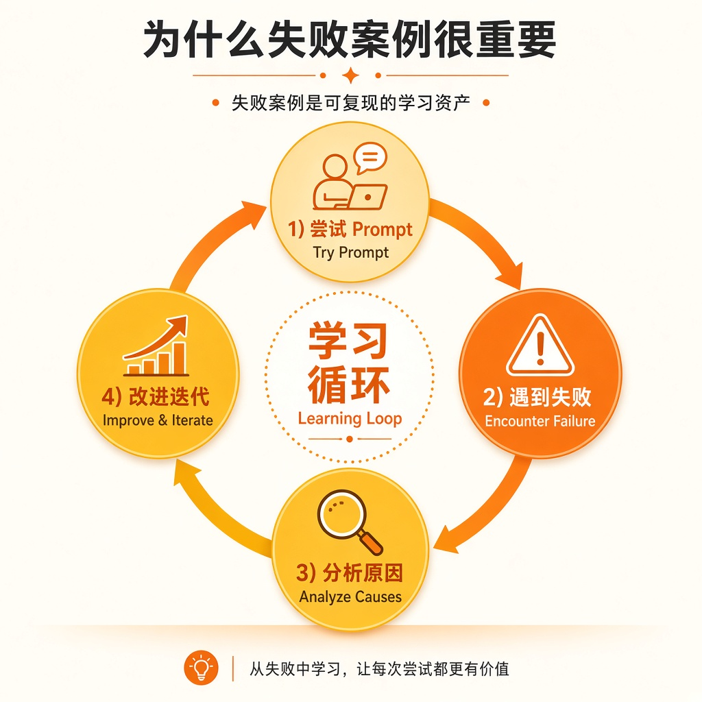
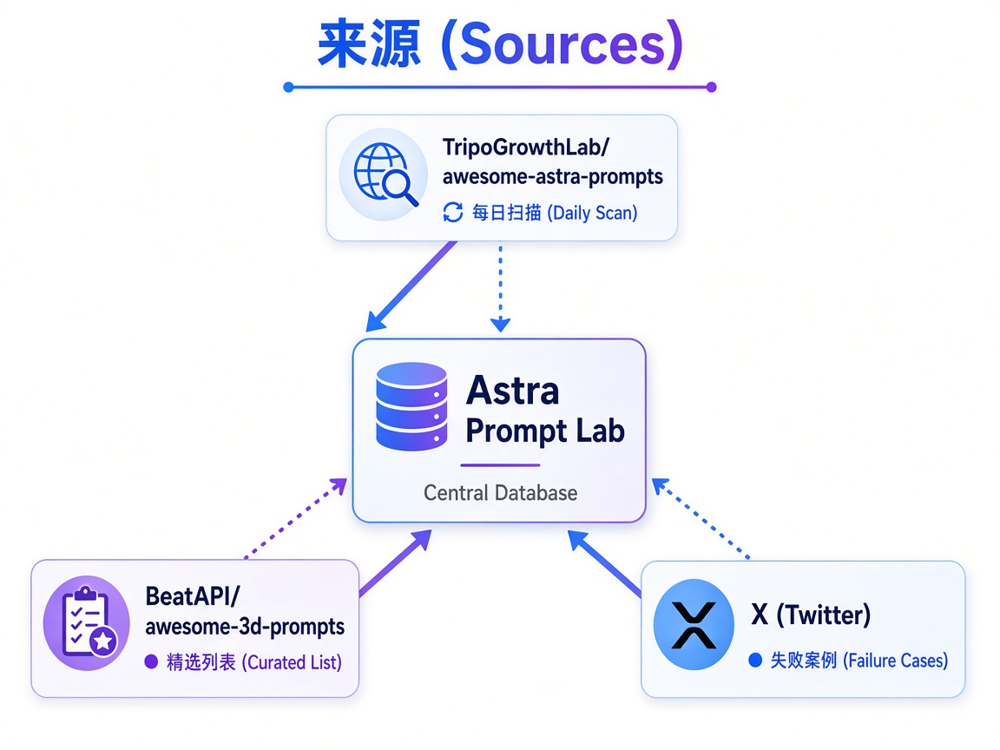
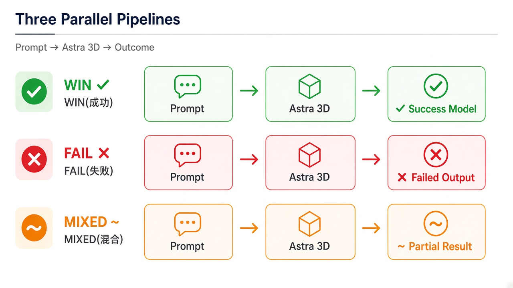

# Astra Prompt 实验场

[English](README.md) | 简体中文

**真实世界的 Astra 提示词：成功、失败和混合结果——不粉饰，不筛选。**

---

## 🎯 一句话说清楚

这是一个独立的 **GPT-6 Astra 提示词实验场**，记录真实创作者的赢、败、混合案例——与精选榜不同，我们特意保留失败案例，因为它们是最稀缺的学习资产。

---

## 💡 为什么要做这个



### 精选榜的盲区

当你打开 Tripo 的官方精选列表，看到的都是精心策划的成功案例。它们很美，但也很危险——**因为你看不到什么不行**。

一个只展示成功的数据集会误导三类人：

1. **创作者**：复制"成功提示词"后发现效果完全不同，不知道哪里错了
2. **研究者**：缺少失败模式的分布数据，无法构建真实的评估基准
3. **站长 / 工具开发者**：需要完整的边界案例来测试 API 鲁棒性

### 失败案例是可复现的资产

不同于成功案例（可能有运气成分、隐藏参数、版本差异），**失败案例往往高度可复现**：

- "生成建筑时玻璃总是变形" ← 这是结构性问题
- "动物的腿经常断开" ← 这是边界 case
- "包含'透明'关键词时崩溃" ← 这是 bug pattern

这些失败案例一旦被记录，就成为：

- ✅ **负样本数据集**，可用于模型评估
- ✅ **边界测试库**，可用于 API 稳定性验证
- ✅ **反模式手册**，可用于创作者教学

### 我们服务谁

- **创作者**：想知道哪些坑别人踩过，快速避开
- **研究者 / 开发者**：需要真实的失败分布来训练 / 测试系统
- **站长 / 联盟主**：需要完整案例库来做内容营销和 SEO（我们本身就是 astra3d.app 的站长）

---

## 📊 与 Tripo awesome 列表的区别

| 维度 | TripoGrowthLab/awesome-astra-prompts | **Astra Prompt Lab（本项目）** |
|------|--------------------------------------|-------------------------------|
| **定位** | 精选榜：只展示成功案例 | 实验场：成功 + **失败** + 混合 |
| **失败案例** | ❌ 不收录 | ✅ **主动收录，是核心资产** |
| **数据来源** | 人工精选 | 三源自动/半自动intake（见下） |
| **更新频率** | 不定期 | 每日扫描 + 实时 X 采集 |
| **归属** | Tripo 社区驱动 | 独立项目（与 astra3d.app 关联） |
| **适合谁** | 想要灵感的创作者 | 想要完整真相的研究者 / 开发者 / 站长 |

我们**不是** Tripo 的官方项目，我们是独立维护的实验场。我们尊重 Tripo 精选榜的价值，同时补充它未覆盖的部分。

---

## 🔄 三源更新机制



### 来源 1: TripoGrowthLab/awesome-astra-prompts

- **类型**：成功案例为主
- **频率**：每日自动扫描
- **策略**：对比上次快照，增量同步新增 prompts
- **注意**：这不是 Tripo 产品官方的列表，是社区驱动的精选集

### 来源 2: BeatAPI/awesome-3d-prompts

- **类型**：跨模型 3D 提示词（包含 Astra 相关）
- **频率**：每周扫描
- **策略**：筛选 Astra 标签，去重后导入

### 来源 3: X (Twitter) 失败案例采集

- **类型**：**主动搜集的失败 / 混合案例**
- **频率**：实时 + 人工复核
- **策略**：
  - 搜索关键词: `"Astra" + "failed"`, `"Astra" + "不行"`, `"Astra" + "bug"`
  - 人工验证：确认是真实失败 case，不是用户误解
  - 脱敏处理：如涉及用户隐私，模糊化处理

---

## 📦 案例结构

每个案例记录为一个 JSON 对象（或 YAML，未来可能迁移）：

```json
{
  "id": "astra-fail-2024-09-001",
  "type": "fail",  // "win" | "fail" | "mixed"
  "prompt": "A transparent glass dragon with wings",
  "model_version": "astra-6.0",
  "timestamp": "2024-09-10T08:30:00Z",
  "source": "x-twitter",
  "source_url": "https://x.com/user/status/123456",
  "result_description": "翅膀部分渲染成功，但透明材质导致身体完全不可见",
  "failure_category": "material-transparency",
  "reproducible": true,
  "attachments": [
    "assets/astra-fail-2024-09-001-output.png"
  ]
}
```

### 案例类型说明



- **WIN (成功)**: 提示词按预期生成高质量 3D 模型
- **FAIL (失败)**: 完全无法生成，或生成结果严重偏离预期
- **MIXED (混合)**: 部分成功，但有明显缺陷（仍可作为反面教材）

---

## 🤝 如何贡献

我们欢迎所有类型的案例，**尤其是失败案例**！

### 提交失败案例（最有价值）

1. Fork 本仓库
2. 在 `prompts/` 目录下创建新的 JSON 文件
3. 填写完整字段（见上面的 schema）
4. **必须**：附上输出截图或说明，证明失败可复现
5. 提交 PR，标题格式：`[FAIL] 简短描述失败现象`

### 提交成功 / 混合案例

同样流程，但注意：

- 成功案例我们优先收录「非常规的」（如多物体组合、复杂材质）
- 混合案例需说明哪里成功、哪里失败

### 为什么要 Star？

- ⭐ **对创作者**：Star 数是可信度信号，告诉后来者「这个库有人在用」
- ⭐ **对研究者**：GitHub Star 常用于数据集引用计数
- ⭐ **对我们**：激励持续维护（我们是站长，但也是社区的一部分）

---

## ⚠️ 免责声明与归属

### 数据来源归属

- **TripoGrowthLab/awesome-astra-prompts**: 社区维护的精选列表，非 Tripo 官方
- **BeatAPI/awesome-3d-prompts**: Beat API 团队维护的跨模型提示词库
- **X (Twitter) 案例**: 经用户公开发布后采集，已脱敏处理

我们在每个案例中都保留原始来源链接（`source_url`），以尊重原作者。

### 商业关联

- 本项目维护者运营 **astra3d.app**，一个推广 Tripo Studio 的联盟站点（via=3dpro）
- 我们**不是** OpenAI、Tripo、或 Beat API 的官方团队
- 案例库采用 MIT License（见 LICENSE），可自由使用，但需注明出处

### 失败案例的伦理

- 我们不收录带有攻击性、诽谤性的"失败案例"
- 我们不批评 Astra 模型本身——失败是 AI 研究的正常部分
- 我们鼓励建设性讨论，而非单纯吐槽

---

## 📮 联系我们

- **官网**: [astra3d.app](https://astra3d.app)
- **GitHub Issues**: 对项目有建议或发现问题？[开个 Issue](https://github.com/danielas2022/astra-prompt-lab/issues)
- **邮件**: 见 GitHub profile（适用于商务合作或隐私问题）

---

## 🙏 致谢

感谢所有愿意公开分享失败案例的创作者——你们的「翻车现场」是后人的避坑指南。

---

<p align="center">
  <sub>独立维护 · 非官方项目 · 数据驱动</sub><br>
  <sub>Built with ❤️ by <a href="https://astra3d.app">astra3d.app</a> team</sub>
</p>
